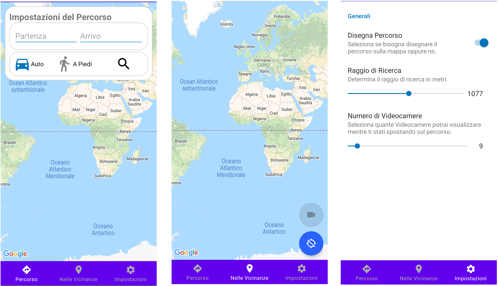

* [CARTOON](#cartoon)
* [Setup](#setup)
* [Installation](#installation)


# CARTOON
An android application,made for an university thesis, that is able to locate the user and dynamically show any near-by security camera that it is available
at a specific URL, fetched from the backend server (https://github.com/AdrianoDiDio/CARTOONBackend).

<p align="center">
    
    <br>
    <em>Main Interface</em>
</p>

<p align="center">
    
    <br>
    <em>Camera Details</em>
</p>

Setup
=====
Application is configured to connect to a specific backend server by using the URL specified in
the file:
```
app/src/main/java/com/adriano/cartoon/Constants.java
```
Using the variable:
```java
public static final String LOCAL_SERVER_ADDRESS = "http://192.168.1.137/";
```

If the server is ran without a certificate or has a self-signed
certificate, Android will block any attempt to connect to it.
In order to workaround this issue the Manifest file must be
modified by adding the following line:
```xml
android:networkSecurityConfig="@xml/network_security_config"
```
Then the file network_security_config,found at res/xml/
must be updated with the following data:
```xml
<?xml version="1.0" encoding="utf-8"?>
<network-security-config><base-config cleartextTrafficPermitted="true" />
    <domain-config cleartextTrafficPermitted="true">
        <domain includeSubdomains="true">
          Ip-Address Of the Server
        </domain>
    </domain-config>
</network-security-config>
```
this will force application to connect trough http without
any complaint from the system network policy.

Before building the APK make sure to generate all the API key required by the application.  
You will need two API key: one to load the map view and the other one to fetch any information about the address or for calculating
the path between two points.  
The map view API key, must be generated from the google cloud console, and will be used to display the main interface of the application.  
The other one, can be, either generated from google cloud or from OpenRouteService.  
The application has a build flag (USE_GOOGLE_MAPS_REST_CLIENT) that let the user choose which service to use, by default, it will use OpenRouteService since it's free and
has no limitations.  

To configure the API keys, you will need to modify the file:
```
app/src/debug/res/values/google_maps_api.xml
```
if in debug otherwise:
```
app/src/release/res/values/google_maps_api.xml
```
and put:
```xml
<resources>
    <string name="google_maps_key" templateMergeStrategy="preserve" translatable="false">Map API KEY</string>
    <string name="google_maps_rest_api_key" templateMergeStrategy="preserve" translatable="false">API Key</string>
    <string name="open_route_service_api_key" templateMergeStrategy="preserve" translatable="false">OpenRouteService API Key</string>
</resources>
```
where 'google_maps_rest_api_key' and 'open_route_service_api_key' are mutually exclusive, you need to specifiy just one depending from the
build configuration, while 'google_maps_key' is mandatory and needs to always be present in order for the application to work properly.

Installation
============
You can install it using AndroidStudio by setting the phone/emulator in debug mode and running directly from the application.
